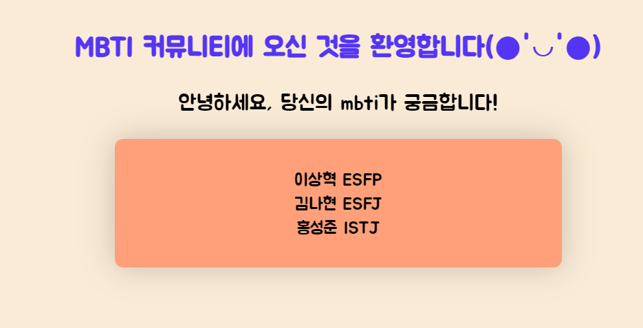
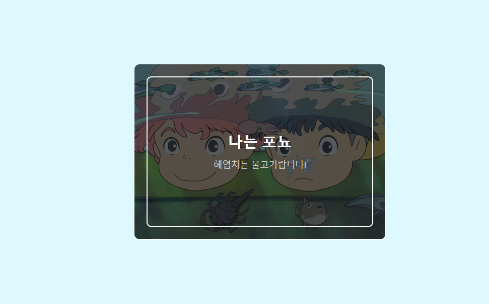
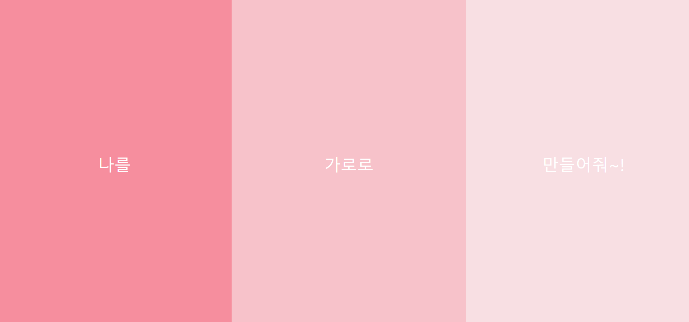

# Week 1 - html, css + git 실습하기

지금부터 아래의 안내사항에 따라 팀원들과 과제를 수행하시길 바랍니다!

# 주의사항

0. 팀별로 과제 수행 순서를 정합니다 예: 1번 이상혁 -> 2번 최주용 -> 3번 김나현 ....
1. 반드시!!!! 순서에 맞게 과제를 진행해주세요! (충돌 싫어용ㅜㅜ)
2. 가장 첫번째로 과제를 진행할 1번 순서는 카톡방의 파일을 다운로드 받은 후 버전 생성(커밋) -> 자신의 github 레포지토리 생성 -> push 합니다
3. 나머지 팀원들은 올려진 레포지토리에 있는 파일을 clone 합니다!
4. 이제 순서에 맞게 과제코드를 작성 후 push/pull
5. 한 명이 push 했다면 다른 사람들은 반드시 pull 하고 과제를 풉니다!!
6. 커밋 메세지는 다음와 같이 작성합니다 -> "이상혁: 1번 문제" "최주용: 2번 문제" "김나현: 3번문제"
7. 모든 팀원들이 과제를 다 해결했다면 과제사이트에 해결한 깃허브 레포지스토리 리크를 올려주세요!!

# 방법 순서 예시:

1번이 파일을 다운로드 받은 후 자신의 깃허브 레포지토리에 push한다.
다른 팀원들은 그 코드를 clone 받는다
1번이 모두 clone받는 것을 확인하면 1번 과제를 작성 후 push한다
다른 팀원들 모두 pull한다
2번이 2번 과제를 작성 후 push한다
다른 팀원들 모두 pull한다
.
.
.
끝날때까지 반복..!

# 실습과제

1번문제: "Possibility To Reality 당신의 내일과 가장 가까운 오늘을 만듭니다"
저희 likelion의 자랑스런 슬로건이 적혀있는 로그인 폼이 존재합니다!!
아래에는 로그인하기 버튼이있네요!!
그러나 저 슬로건들과 로그인하기 css 코드가 인라인스타일로 작성되어있네요...
색도 마음에 들지 않아요 ㅜㅜ
css 코드를 내부스타일 방식으로 작성하여 아래와 같은 결과를 만들어보세요!!

변경을 완료하셨다면 색상도 자유자제로 변경해보셔도 됩니다.

2번문제: 우리 조원의 mbti가 궁금해요! 서로의 mbti를 공유하고 이름과 mbti를 작성합니다!
다만 조건이 있습니다! 아래 사진과 비슷하게 만들어주세요!

3번문제: 으앗! 글씨체가 딱딱하니.. 너무 마음에 안들군요!! 구글 폰트(Google font)에는 정말 다양한 폰트가 존재합니다!
구글 폰트를 사용해서 Indie Flower 폰트로 모두 바꿔주세요! 단, link와 @import 중 @import를 사용합니다!

4번문제: 이런이런 3개의 박스가 세로로 정렬이 되어있네요;; 게다가 화면창의 크기를 바꾸면 가운데만 커지는 대참사ㅠㅠ
박스안의 글씨를 읽을 수 있도록 가로로 정렬하고, 세 박스 모두 화면창의 크기에 맞추어 일정하게 크고 작아지게 만들어보아요!
(필요없는 코드는 지워도 됩니다!)

# (참고)cmd 명령어

- cd <폴더명> : 들어가고 싶은 폴더에 접속하기
- cd .. : 상위 폴더에 들어가기
- pwd : 현재 폴더(root 폴더)
- ls : 현재 폴더에 어떤 폴더와 파일이 있는지 확인
- ls -al : 숨겨진 폴더/파일도 확인할 수 있음

# 화이팅 화이팅! 모르는 부분이 있으면 서로 토의하면서 질문해주세요!
